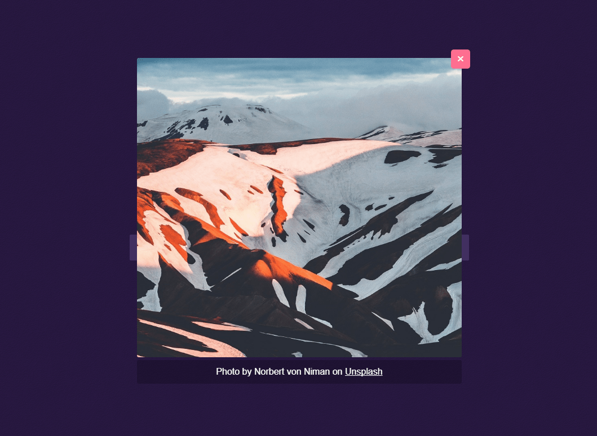
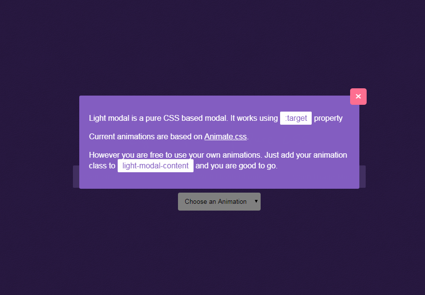

<h3>Light Modal</h3>

<a href="https://hunzaboy.github.io/Light-Modal/">View the Awesome Demo</a>

A simple light-weight yet <strong>Powerful</strong> and <strong>Customizable</strong> <code>css</code> modal for content and images.

<a href="https://hunzaboy.github.io/Light-Modal/"> Click here for a DEMO &
 How to use</a>
 
 <h3>Compatibility </h3>
 IE9+, Safari, Chrome, Firefox 
 
 <em>Light Modal uses Flex and Target CSS properties.</em>

<h3>To Do </h3>
<em>Fell free to submit a PR </em>

- [ ] JS Version
- [ ] IE9 and/or below

<h3>Changelog</h3>
v 1.2.0 - Updated package.json, added css variables, removed gulp for building etc
v 1.1.0 - Added new Gallery Mode

